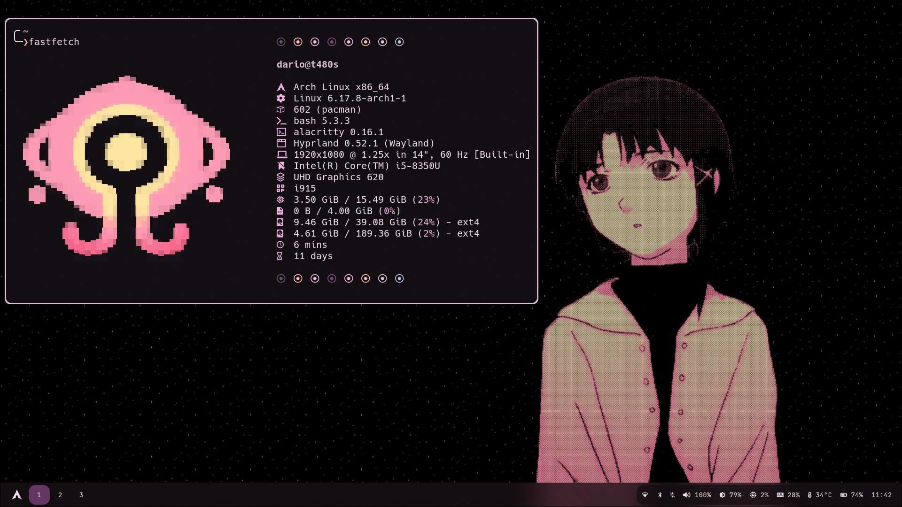
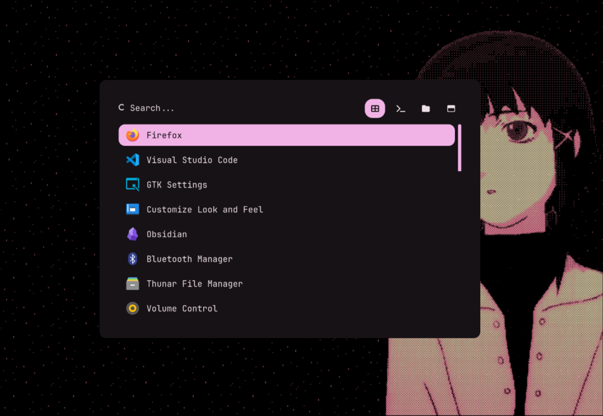
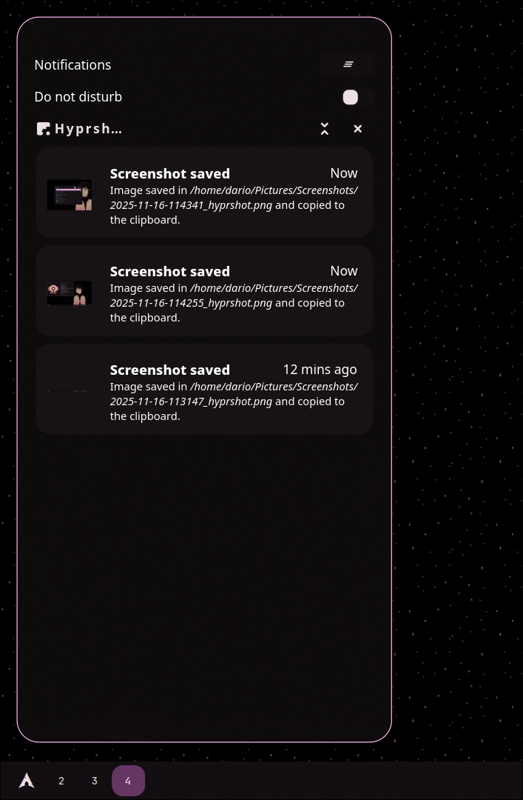

# Hyprland Dotfiles

My Personal configuration files for my Wayland-based Arch Linux setup using **Hyprland**
This repository contains all of my `.config` files, scripts, themes, and UI customizations.

These dotfiles allow me to easily back up, track, and share my Linux Rice.

---

## ✨ Features

- Fully featured **Hyprland** setup  
- Consistent theming powered by **Matugen** (automatic color generation)  
- Integrated theme sync across:
  - Waybar  
  - Rofi  
  - GTK   
  - Terminal & Starship prompt  
  - Notifications (SwayNC)  
- Custom scripts for workflow automation  
- Clean, minimal, and readable configuration structure  
- Easy to extend and customize  

---

## 🎨 Matugen Integration

The entire rice is designed around **[Matugen](https://github.com/InioX/matugen)**, which dynamically generates colors based on your wallpaper or a selected palette.

- Global theme consistency  
- Automatic color injection into Hyprland, Waybar, Starship, Rofi, GTK, etc.  
- No unnecessary icons, backgrounds, or decorations added — only coherent colors  
- Fast theme updates with a single command  

Matugen is the central core of the theming system.

---

## 📸 Screenshots

### Rofi

### Waybar

### Notifications (Swaync)

---

## 🙏 Inspirations & Credits

These dotfiles were inspired by several creators and projects.  
Full credit to the following people and repositories:

### Waybar
- [SimpleBlueColorWaybar](https://github.com/d00m1k/SimpleBlueColorWaybar)

### Rofi
- [adi1090x/rofi](https://github.com/adi1090x/rofi)

### Hyprlock / Swaync 
- [zDyant/HyprNova](https://github.com/zDyant/HyprNova)

### Fastfetch
- [LierB/fastfetch](https://github.com/LierB/fastfetch)

### Wallpapers (from Lain)
- [FlexUnder/Lain-linux-rice](https://github.com/FlexUnder/Lain-linux-rice)

If I used part of your work and haven’t credited you yet, please open an issue and I will gladly add you.

---